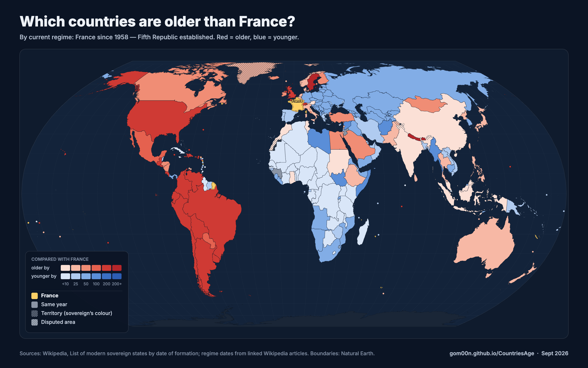

# Country Age Map

**Which countries are older than yours?** An interactive world map that colours
every state by its age under three definitions of when a country's clock starts,
compared against any country you pick. Built for settling arguments: every view
has a shareable link, a one-click PNG export with title, legend and source line,
and a linked source for every date.

Live: **https://gom00n.github.io/CountriesAge/**



## Features

- **Three clocks.** First sovereignty, last liberation from a foreign power, or
  the establishment of the current regime. Switch instantly; the headline, legend
  and export all say which clock is in use.
- **No gaps, one standard.** Borders follow control on the ground; every
  contested area carries the same hatch with an "administered by / claimed by"
  note. Dependent territories take their sovereign's colour (Greenland as
  Denmark, Puerto Rico as the US). Partially recognised states with effective
  control get entries. Tiny islands get a dot at world scale.
- **Screenshot-ready.** Equal Earth projection, no basemap tiles, a headline
  that states the question, a compact legend, and a **Download PNG** / **Copy
  image** button that renders a 2400×1500 image with title, legend, source line
  and URL.
- **Shareable.** The URL hash records the selected country, clock and detail
  mode, so `#c=ISR&t=regime&m=detailed` reproduces a view exactly.
- **Sourced.** Each country panel links to its Wikipedia article and to the
  specific source for the date shown. The **Sources** dialog in the app explains
  the definitions and caveats.

No build step and no backend: static HTML, CSS and JavaScript with
[d3-geo](https://github.com/d3/d3-geo) and
[topojson-client](https://github.com/topojson/topojson-client) from a CDN.

## Run it locally

```bash
python3 -m http.server 8000
```

Then open http://localhost:8000. A local server is needed because the page
fetches the data files.

## The three clocks

| Clock | Meaning | Source |
|---|---|---|
| **First sovereignty** | Earliest date the state became sovereign. Often a founding dynasty or unification for old states (Denmark 714, Japan 539). | Wikipedia list (below), column "Date of sovereignty" |
| **Last freed** | Date the state last gained or regained sovereignty from a foreign power: decolonisation, end of occupation, secession. Internal revolutions do not count. | Wikipedia list, column "Last subordination" |
| **Current regime** | When the political system in place today was established: revolution, new constitution, reunification, end of a dictatorship. | Hand-curated for 71 states, one linked Wikipedia article each; all other states fall back to "last freed" |

Ages are computed from the year only, against the current year.

## Data sources

| Source | Used for | Retrieved | Licence |
|---|---|---|---|
| [List of modern sovereign states by date of formation](https://en.wikipedia.org/wiki/List_of_modern_sovereign_states_by_date_of_formation) (Wikipedia) | Sovereignty and last-subordination dates, previous power, capital, continent for 196 states | 9 April 2026 | CC BY-SA 4.0 |
| Individual Wikipedia articles (one per curated regime date; listed in [`add_political_date.py`](add_political_date.py) and linked from the app) | Current-regime dates and notes for 71 states | reviewed 18 September 2026 | CC BY-SA 4.0 |
| Hand-written entries in [`add_extras.py`](add_extras.py) | Taiwan, Northern Cyprus, Somaliland, Abkhazia, South Ossetia, which the Wikipedia list omits; two or three Wikipedia articles each | 18 September 2026 | CC BY-SA 4.0 (Wikipedia-derived) |
| [Natural Earth](https://www.naturalearthdata.com/) 1:50m Admin 0 – Countries | Boundaries, territory-to-sovereign mapping, ISO codes | v5.1.1 | Public domain |
| [Natural Earth](https://www.naturalearthdata.com/) 1:50m Admin 0 – Breakaway, Disputed Areas | Hatched disputed overlay; Abkhazia and South Ossetia polygons | v5.1.1 | Public domain |

The full provenance list is also in [`data/sources.json`](data/sources.json).

## Files

| Path | What it is |
|---|---|
| `index.html`, `style.css`, `app.js` | The app |
| `data/countries.json` | Per-country dates, notes, sources and ISO codes consumed by the app |
| `data/world.topo.json` | Country polygons as quantised TopoJSON (780 KB), built from `data/world.geojson` |
| `data/disputed.topo.json` | Natural Earth 1:50m breakaway and disputed areas, used for the uniform hatch and for the Abkhazia / South Ossetia units |
| `data/world.geojson` | Natural Earth admin-0 source polygons (not loaded by the app) |
| `data/sources.json` | Machine-readable provenance for everything above |
| `countries.json`, `countries.csv` | Raw scrape output, before ISO codes and regime dates are added |

## Rebuilding the data

```bash
pip install requests beautifulsoup4 pycountry
python3 scrape.py               # Wikipedia list -> countries.json / countries.csv
python3 add_iso.py              # attach ISO alpha-3 codes -> data/countries.json
python3 add_extras.py           # add polities missing from the list (Taiwan, Somaliland, …)
python3 add_political_date.py   # add curated regime dates + sources
./build_topo.sh                 # Natural Earth -> data/world.topo.json + data/disputed.topo.json (needs Node)
```

After changing anything under `data/`, bump `DATA_VERSION` in `app.js` so
browsers refetch.

## Borders and recognition

Two explicit rules, applied uniformly:

1. **Borders follow control on the ground.** The base polygons are Natural
   Earth's default (de facto) view: Crimea is coloured as Russia, the Golan
   Heights as Israel, Kashmir is split along the Line of Control, Western Sahara
   is coloured as Morocco. Colour is never an endorsement of a claim.
2. **Every contested area is hatched the same way**, from Natural Earth's
   "breakaway and disputed areas" layer (`data/disputed.topo.json`): Crimea,
   Donetsk and Luhansk, Golan, Jammu and Kashmir, Gilgit-Baltistan, Aksai Chin,
   Arunachal Pradesh, Western Sahara, Transnistria, Abyei, the Ilemi Triangle,
   the Kurils, North Borneo and others. Hovering shows who administers and who
   claims it. Artsakh is omitted because it was dissolved in 2024.

**Who gets an entry.** UN members and observers come from the Wikipedia list.
Beyond that, a polity gets an entry when it is recognised by at least one UN
member state *and* controls most of the territory it claims. That adds Kosovo,
Taiwan, Northern Cyprus, Somaliland, Abkhazia and South Ossetia; each carries a
"Status" line stating its recognition and who claims it. Transnistria (no
UN-member recognition) and the Sahrawi Republic (controls only a strip of
Western Sahara) do not get entries and stay hatched. Abkhazia and South Ossetia
use the non-ISO ids `ABK` and `SOS`.

## How the map handles edge cases

- **Territories** are classified with Natural Earth's sovereign code. Anything
  whose sovereign has an entry in the dataset is drawn in that country's colour
  with a dark hatch and labelled "Territory of …" on hover. They are not counted
  in the older/younger totals.
- **Siachen Glacier** has no administering state in the data and is drawn grey.
  Antarctica is drawn in a neutral tone.
- **Borders** are drawn once from the shared-edge mesh, so adjacent countries
  never leave seams or double lines.
- **Small states** (Malta, Singapore, Caribbean and Pacific islands) are drawn
  as dots until you zoom in far enough for their outline to be visible.

## Caveats

"How old is a country" has no single right answer, which is why there are three
clocks. Founding dates for old states are conventions, not facts. Regime dates
involve judgement: coups that swapped one junta for another were mostly not
counted, and the curated list leans toward well-documented cases. Corrections
are welcome as issues or pull requests; please include a source link.

## Licence

Code: [MIT](LICENSE). Data derived from Wikipedia: CC BY-SA 4.0. Boundaries:
Natural Earth, public domain. Exported images carry a source line; please keep it.
